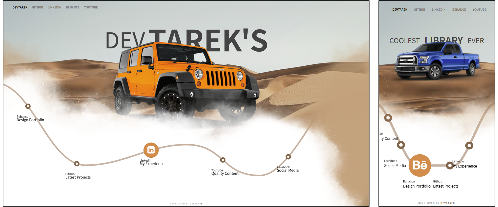

# Vanilla JS Landing Page with SVG Animations
##### [Open Live Preview](https://dev-tarek.github.io/vanilla-animated-landing/)

___
## Contents
* [Introduction](#introduction)
* [Features](#features)
* [Classes](#classes)
* [Synchronization](#synchronization)
* [Examples](#examples)
* [Structure](#project-structure)
___

## Introduction
This is a vanilla HTML-CSS-JS template to customize and develop - not a fully functional view. All code was written from scratch for practicing so this may not be the optimal implementation for you.

## Features
* Basic navigation bar
* Animated text / titles
* Basic image carousel
* Dynamic SVG Path rendering
* Circle shaped buttons with icons and linked text
* Control each transition speed and duration
* Fully responsive

## Classes

### AnimatedText
Parameters:
- {DOM element object} container - DOM element to render the animated text on
- {array} textList - array of {_text objects_}, each object represents a _text line_ in the animated text loop, and contains:
    - `[text]`: array of words making a _text line_
    - `[in]`: array of entry [animations](#animations) for words in `[text]`
    - `[out]`: array of exit [animations](#animations) for words in `[text]`
    (_Note: the elements of the three arrays are linked by index and thus the arrays must have the same length. Error is currently not handled._)
- {object} options:
    - transitionSpeed - text transition time (ms)
    - swipeDealy - delay before the current _text line_ is changed (ms)

Methods:
- render - renders the next line
- play - initiates the animation loop

#### Animations
Current implemented animations:
- SLIDE_UP
- SLIDE_RIGHT
- SLIDE_DOWN
- SLIDE_LEFT
- FADE_IN
- FADE_OUT

### Carousel
Parameters:
- {DOM element object} carousel - DOM element to render the carousel on
- {array} images - array of {_image objects_}, each contains:
    - [src]: path to the image file
    - [alt]: image alternative text
- {object} options:
    - {number} transitionSpeed - text transition time (ms)
    - {number} swipeDealy - delay before the current image is changed (ms)

Methods:
- render - renders the next image
- play - initiates the animation loop

### Path
Parameters:
- {string} svgId - target SVG element id to render the path inside
- {array} pointsPercents - contains arrays of [x, y] in percentages of the [width, height] of current view
- {object} options:
    - {number} transitionSpeed - text transition time (ms)
    - {number} swipeDealy - delay before the current image is changed (ms)
    - {string} color - path stroke color
    - {string} width - path stroke width
    - {string} cap - path linecap ```butt | square | round [default]```
    - {string} fill - path fill color ```default: transparent```
    - {number} control - control point offset for each curve ```default: 100```

Methods:
- getPathElement - returns the path element
- getPathCurve - returns the path curve as in [d] attirbute
- updatePointPercents - parameters:
    - {array} pointsPercents
    - {bool} regenerate
    Used to set new _pointsPercents_ to path object, and _regenerate_ the path curve (useful for responsiveness).
- updateControl - parameters:
    - {number} control
    - {bool} regenerate
    Used to set new _control_ to path object, and _regenerate_ the path curve (useful for responsiveness).
- calculatePoints - calculate points in [x, y] values from _pointsPercents_
- generatePath - create the path curve as in [d] attirbute
- render - render the path graphics inside the target SVG

### CircleObject
Parameters:
- {DOM G element} circlesGroup - parent SVG group element to contain the circle and text elements
- {object} options:
    - {DOM Path element} path - parent path for the circle to follow
    - {number} radius - the normal radius of the circle
    - {number} hoverRadius - the radius of the circle on hover event
    - {string} iconCode - unicode string of the icon to be displayed inside the circle
    - {array} description - contains [_string_ title, _string_ text] that should follow the circle
    - {array} descriptionMargin - contains [_num_ dx, _num_ dy] the margin offset of the description text from the circle
    - {string} className - by default is `circle-obj` for styling
    - {array} positions - contains cricle stopping points on the path in percentages
    - {integer} positionIndex - initial start index in _positions_ for the circle
    - {integer} activeIndex - index in _positions_ that circle will be automatically active at
    - {function} clickHandler - function for circle click event
    - {number} fadeSpeed - transition time for fading in and out in ms

Methods:
- createElements - create and append the circle and icon elements to the circlesGroup
- activateCircle - set the circle state to active
- resetCircle - reset the circle state to inactive
- renderDescriptionText - create and append the description text to the circlesGroup
- updateIconText (`code`) - updates the icon code
- getPosition - current circle position in percentage
- updatePosition (`steps = 0`) - move the `steps` in _positions_, if `steps = 0` it will update inplace (useful for responsiveness)
- getPositionPoint - returns the circle position as point [x, y] on the parent path

## Synchronization
So far the view is not in real synchronization since it was implemented as a preview and not yet fully functional as mentioned. If you need to sync the transitions together, you can use `timeControl` object in `index.js` together with `timeControl.css` file.

## Examples
_Consider going through `index.js` for a full example._

Creating Animated Text
```js
let textList = [
    {
        text:   ['dev',        'tarek\'s'],
        in:     [an.SLIDE_DOWN, an.SLIDE_UP],
        out:    [an.SLIDE_DOWN, an.SLIDE_UP],
    },
    {
        text:   ['coolest',      'library',      'ever'],
        in:     [an.SLIDE_RIGHT, an.SLIDE_DOWN,  an.SLIDE_LEFT],
        out:    [an.SLIDE_RIGHT, an.FADE_OUT,    an.SLIDE_LEFT],
    },
]
let animatedText = new AnimatedText(animatedTextContainer, textList, {
    transitionSpeed: timeControl.animatedTextSpeed,
    swipeDelay: timeControl.animatedTextDelay
});
animatedText.play()
```

Creating a Carousel
```js
const images = [
    {src: '/images/carousel/jeep.png', alt: 'Jeep'},
    {src: '/images/carousel/ford.png', alt: 'Ford'},
];
let carousel = new Carousel(carouselContainer, images, {
    swipeDelay: timeControl.carouselSwipeDelay,
    transitionSpeed: timeControl.carouselSpeed
});
carousel.play()
```
Creating a Path
```js
let pathPointsPercents = [ 
    [-2.5, 40], 
    [22.5, 80], 
    [50, 70], 
    [70, 85], 
    [100, 30]
];
let path = new Path(svgId, pathPointsPercents, {
    color: 'orange',
    width: '8',
});
path.render()
```
Creating Circle objects on the Path
```js
// Create SVG group for all circles
let circlesGroup = document.createElementNS(SVG_DOC, 'g');
circlesGroup.setAttribute('class', 'circles-group'); // For CSS
svgElement.appendChild(circlesGroup); // Append the group to the SVG

let circles = [
    { iconCode: '&#xf1b4;', path: path, description: {title: 'Behance', text: 'Design Portfolio'} },
    { iconCode: '&#xf09b;', path: path, description: {title: 'Github', text: 'Latest Projects'} },
];
let circleObjects = []; // Array to save objects references
circles.map((circle, index) => {
    let circleObject = new Circle(circlesGroup, { 
        ...circle,
        positionIndex: index,
        fadeSpeed: timeControl.circlesFadeSpeed,
    });
    circleObject.render();
    circleObjects.push(circleObject);
})

// Autoplay all circles
let circleStep = 1;
setInterval(() => {
    circleObjects.map(circle => circle.updatePosition(circleStep));
}, timeControl.circlesInterval)
```

## Project Structure

```
|-- root
    |-- index.html
    |-- README.md
    |-- css/
    |   |-- index.css
    |   |-- timeControl.css
    |   |-- components/
    |   |   |-- AnimatedText.css
    |   |   |-- Carousel.css
    |   |   |-- Navbar.css
    |   |   |-- SVG.css
    |-- images/
    |   |-- credits.txt
    |   |-- desert.jpg
    |   |-- fog.png
    |   |-- carousel/
    |   |   |-- expedition.webp
    |   |   |-- f150.png
    |   |   |-- ford.png
    |   |   |-- jeep.png
    |   |   |-- pathfinder.png
    |   |   |-- toyota.png
    |   |-- masks/
    |   |   |-- mask1.png
    |   |   |-- mask2.png
    |   |   |-- maskOverlayL.png
    |   |   |-- maskOverlayR.png
    |-- js/
    |   |-- index.js
    |   |-- components/
    |   |   |-- AnimatedText.js
    |   |   |-- Carousel.js
    |   |   |-- CircleObject.js
    |   |   |-- Path.js
    |   |-- helpers/
    |   |   |-- Helpers.js
```
